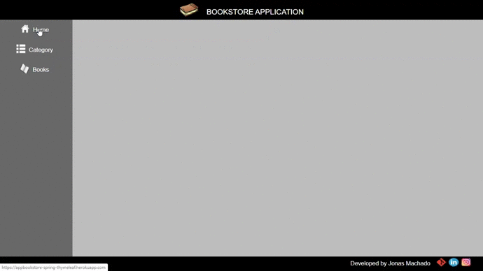

<h1 align="center"> AppBookStore-Spring-Thymeleaf</h1>

<p align="center">
  <br>
	
</p>

<h2> Sobre / About</h2>

  <p> Esse app é um CRUD de livros  e categorias.</p>
  <p> No BackEnd foi utilizado o springBoot MVC</p>
  <p> No Front End foi Utilizado HTML e CSS e o Thymeleaf para fazer a conexao do HTML com o SpringBoot </p>
  <br><br>
  <p> This App is a CRUD of books and categoryss </p>
  <p> In the BackEnd was using the SpringBoot MVC</p>
  <p> In the FrontEnd was using  HTML, CSS and Thymeleaf to do the connect HTML with the SpringBoot</p>
  <br>
  
<h2> Tecnologias utilizadas / Technologies used </h2>

<u1>
  <li><a href="https://www.oracle.com/br/java/technologies/javase-jdk11-downloads.html"> JDK 11 </a> : Java Development Kit 11 - um kit de desenvolvimento para 
    	construção de aplicações e componentes usando a linguagem de programação Java;</li>
  <li><a href="https://netbeans.apache.org/download/index.html"> NetBeans</a> : O NetBeans IDE é um ambiente de desenvolvimento integrado gratuito e de código aberto 
    	para desenvolvedores de software nas linguagens Java.</li>
  <li><a href="https://spring.io/"> Spring Boot MVC </a> : O Spring é um framework open source para a plataforma Java criado. Trata-se de um framework não intrusivo,
    	baseado nos padrões de projeto inversão de controle (IoC) e injeção de dependência.</li>
  <li><a href="https://maven.apache.org/"> Maven </a> : Apache Maven, ou Maven, é uma ferramenta de automação de compilação utilizada primariamente em projetos Java.</li>
  <li><a href="https://www.h2database.com/html/main.htmls/"> H2 Database Engine </a> :  H2 é um sistema de gerenciamento de banco de dados relacional escrito em Java para TESTE.</li>
  <li><a href="https://www.postgresql.org/download/"> PostgreSQL </a> : PostgreSQL é um sistema gerenciador de banco de dados objeto relacional.</li>
  <li><a href="https://www.thymeleaf.org/download.html"> Thymeleaf </a> : O Thymeleaf é um mecanismo de modelo Java XML / XHTML / HTML5 que pode funcionar em ambientes web e não web.</li>
  <li><a href=""> HTML </a> : HyperText Markup Language, é uma linguagem de marcação utilizada na construção de páginas na Web.</li>
  <li><a href=""> CSS</a> : Cascading Style Sheets (CSS) é um mecanismo para adicionar estil.</li>
  <li><a href="https://www.heroku.com/"> Heroku </a> : Heroku é uma plataforma em nuvem como um serviço que suporta várias linguagens de programação.</li>
</u1>
<br>

<h2> Intalacao / Installation</h2>

<p>Para baixar o código-fonte do projeto em sua máquina, primeiramente voce terá que ter instalado em seu computador o <a href="https://git-scm.com/"> GIT </a>.</p>
  <p>For download the source code of project in yout PC, firstly you must have install in your PC the<a href="https://git-scm.com/"> GIT </a>.</p>
  <br>
  <p>Com o Git init instalado, em seu terminal execute o seguinte comando:</p>
  <p>With the Git installed, in your terminal execute the following command:</p>
  
   ```
  $ git clone https://github.com/jonasmachados/AppBookStore-Spring-Thymeleaf
  ```
  
 <h2> Author: </h2>
     <b>Jonas Machado</b>
 
  
